%% LLM-Wiki Architecture Diagram
%% Generated: 2026-08-17T16:15:40.591612

```mermaid
graph TD
    subgraph Core[Core Infrastructure]
        hermes[Hermes Agent] -->|reads| obsidian[Obsidian Vault]
        obsidian -->|writes| inbox[Inbox/]
        obsidian -->|reads| scripts[scripts/]
    end

    subgraph Domains[Knowledge Domains]
        subgraph .cnc_knowledge_tree.md[".Cnc_Knowledge_Tree.Md"]
                .cnc_knowledge_tree["[[.cnc_knowledge_tree]]"]
        end
        subgraph .summary_index.md[".Summary_Index.Md"]
                .summary_index["[[.summary_index]]"]
        end
        subgraph .tags.md[".Tags.Md"]
                .tags["[[.tags]]"]
        end
        subgraph AI-Models-Library.md["Ai Models Library.Md"]
                AI-Models-Library["[[AI-Models-Library]]"]
        end
        subgraph CAD-CAM-workflow.md["Cad Cam Workflow.Md"]
                CAD-CAM-workflow["[[CAD-CAM-workflow]]"]
        end
        subgraph COMPLETE_INTEGRATION_REPORT.md["Complete_Integration_Report.Md"]
                COMPLETE_INTEGRATION_REPORT["[[COMPLETE_INTEGRATION_REPORT]]"]
        end
        subgraph G-code-programming.md["G Code Programming.Md"]
                G-code-programming["[[G-code-programming]]"]
        end
        subgraph Precision-manufacturing.md["Precision Manufacturing.Md"]
                Precision-manufacturing["[[Precision-manufacturing]]"]
        end
        subgraph Read_&_Write["Read & Write"]
                org-231207756["[[org-231207756]]"]
        end
        subgraph Robotics-integration.md["Robotics Integration.Md"]
                Robotics-integration["[[Robotics-integration]]"]
        end
        subgraph agent-comparison.md["Agent Comparison.Md"]
                agent-comparison["[[agent-comparison]]"]
        end
        subgraph ai-foundation.md["Ai Foundation.Md"]
                ai-foundation["[[ai-foundation]]"]
        end
        subgraph architecture-diagram.md["Architecture Diagram.Md"]
                architecture-diagram["[[architecture-diagram]]"]
        end
        subgraph cam_workflow.md["Cam_Workflow.Md"]
                cam_workflow["[[cam_workflow]]"]
        end
        subgraph cnc-machining["Cnc Machining"]
                wiki-cnc-overview["[[wiki-cnc-overview]]"]
        end
        subgraph cnc.md["Cnc.Md"]
                cnc["[[cnc]]"]
        end
        subgraph context-window-challenges.md["Context Window Challenges.Md"]
                context-window-challenges["[[context-window-challenges]]"]
        end
        subgraph cross-reference-test-report.md["Cross Reference Test Report.Md"]
                cross-reference-test-report["[[cross-reference-test-report]]"]
        end
        subgraph deep-learning-fundamentals.md["Deep Learning Fundamentals.Md"]
                deep-learning-fundamentals["[[deep-learning-fundamentals]]"]
        end
        subgraph documentation-systems.md["Documentation Systems.Md"]
                documentation-systems["[[documentation-systems]]"]
        end
        subgraph facts.md["Facts.Md"]
                facts["[[facts]]"]
        end
        subgraph fusion360_workflow.md["Fusion360_Workflow.Md"]
                fusion360_workflow["[[fusion360_workflow]]"]
        end
        subgraph future-of-technology.md["Future Of Technology.Md"]
                future-of-technology["[[future-of-technology]]"]
        end
        subgraph git-commands-reference.md["Git Commands Reference.Md"]
                git-commands-reference["[[git-commands-reference]]"]
        end
        subgraph hardware-setup-guide.md["Hardware Setup Guide.Md"]
                hardware-setup-guide["[[hardware-setup-guide]]"]
        end
        subgraph hermes-agent-restore-guide.md["Hermes Agent Restore Guide.Md"]
                hermes-agent-restore-guide["[[hermes-agent-restore-guide]]"]
        end
        subgraph hermes-auto-backup-setup.md["Hermes Auto Backup Setup.Md"]
                hermes-auto-backup-setup["[[hermes-auto-backup-setup]]"]
        end
        subgraph human-humanrobot-collab.md["Human Humanrobot Collab.Md"]
                human-humanrobot-collab["[[human-humanrobot-collab]]"]
        end
        subgraph llm-wiki-setup-guide.md["Llm Wiki Setup Guide.Md"]
                llm-wiki-setup-guide["[[llm-wiki-setup-guide]]"]
        end
        subgraph llm-wiki-vault-management["Llm Wiki Vault Management"]
                LLM-Wiki-Vault-Management["[[LLM-Wiki-Vault-Management]]"] -->     frontmatter-templates["[[frontmatter-templates]]"] -->     vault-navigation-cheatsheet["[[vault-navigation-cheatsheet]]"]
        end
        subgraph loop_examples.md["Loop_Examples.Md"]
                loop_examples["[[loop_examples]]"]
        end
        subgraph material_properties.md["Material_Properties.Md"]
                material_properties["[[material_properties]]"]
        end
        subgraph memories["Memories"]
                master_index["[[master_index]]"]
        end
        subgraph models["Models"]
                gemma-3-27b["[[gemma-3-27b]]"] -->     mistral-nemo-12b["[[mistral-nemo-12b]]"] -->     qwen3.5-hermes-mathematical-optimization["[[qwen3.5-hermes-mathematical-optimization]]"]
        end
        subgraph obsidian-backup-restore-guide.md["Obsidian Backup Restore Guide.Md"]
                obsidian-backup-restore-guide["[[obsidian-backup-restore-guide]]"]
        end
        subgraph obsidian-backup-skill.md["Obsidian Backup Skill.Md"]
                obsidian-backup-skill["[[obsidian-backup-skill]]"]
        end
        subgraph obsidian-hermes-integration.md["Obsidian Hermes Integration.Md"]
                obsidian-hermes-integration["[[obsidian-hermes-integration]]"]
        end
        subgraph optimization-tech.md["Optimization Tech.Md"]
                optimization-tech["[[optimization-tech]]"]
        end
        subgraph profile.md["Profile.Md"]
                profile["[[profile]]"]
        end
        subgraph prompts["Prompts"]
                wiki-context-prompt["[[wiki-context-prompt]]"]
        end
        subgraph python-async-tutorial.md["Python Async Tutorial.Md"]
                python-async-tutorial["[[python-async-tutorial]]"]
        end
        subgraph python-git-cross-reference.md["Python Git Cross Reference.Md"]
                python-git-cross-reference["[[python-git-cross-reference]]"]
        end
        subgraph research-discovery-loops.md["Research Discovery Loops.Md"]
                research-discovery-loops["[[research-discovery-loops]]"]
        end
        subgraph research-synthesis-demo.md["Research Synthesis Demo.Md"]
                research-synthesis-demo["[[research-synthesis-demo]]"]
        end
        subgraph robotics-hardware.md["Robotics Hardware.Md"]
                robotics-hardware["[[robotics-hardware]]"]
        end
        subgraph robotics-history.md["Robotics History.Md"]
                robotics-history["[[robotics-history]]"]
        end
        subgraph robotics-integration-main.md["Robotics Integration Main.Md"]
                robotics-integration-main["[[robotics-integration-main]]"]
        end
        subgraph robotics-software.md["Robotics Software.Md"]
                robotics-software["[[robotics-software]]"]
        end
        subgraph scripts["Scripts"]
                README["[[README]]"]
        end
        subgraph skills["Skills"]
                SKILL["[[SKILL]]"]
        end
        subgraph software-engineer-agents-summary.md["Software Engineer Agents Summary.Md"]
                software-engineer-agents-summary["[[software-engineer-agents-summary]]"]
        end
        subgraph software-engineer-agents.md["Software Engineer Agents.Md"]
                software-engineer-agents["[[software-engineer-agents]]"]
        end
        subgraph system-hardware.md["System Hardware.Md"]
                system-hardware["[[system-hardware]]"]
        end
        subgraph test-report.md["Test Report.Md"]
                test-report["[[test-report]]"]
        end
        subgraph test_compiled.md["Test_Compiled.Md"]
                test_compiled["[[test_compiled]]"]
        end
        subgraph tooling.md["Tooling.Md"]
                tooling["[[tooling]]"]
        end
        subgraph ubuntu_commads.md["Ubuntu Commads.Md"]
                ubuntu-commads["[[ubuntu commads]]"]
        end
        subgraph unknown-user-input.md["Unknown User Input.Md"]
                unknown-user-input["[[unknown-user-input]]"]
        end
        subgraph vault-index.md["Vault Index.Md"]
                vault-index["[[vault-index]]"]
        end
        subgraph vault-synthesis-summary.md["Vault Synthesis Summary.Md"]
                vault-synthesis-summary["[[vault-synthesis-summary]]"]
        end
        subgraph vision-perception-stack.md["Vision Perception Stack.Md"]
                vision-perception-stack["[[vision-perception-stack]]"]
        end
        subgraph wiki-integration-guide.md["Wiki Integration Guide.Md"]
                wiki-integration-guide["[[wiki-integration-guide]]"]
        end
        subgraph wikisystem.md["Wikisystem.Md"]
                wikisystem["[[wikisystem]]"]
        end
    end

    classDef domain fill:#F5F5F5,stroke:#333,stroke-width:2px
    classDef core fill:#E3F2FD,stroke:#1976D2,stroke-width:3px

    class hermes,obsidian,inbox,scripts core
```

<!-- Tag Summary -->
Total domains: 63
<!-- Tags observed: #balanced, #context/128k, #context/8k, #hardware/cpu-gpu, #hardware/gpu-nvidia, Obsidian, Query, Search, Wiki, agents, ai-local, ai-model, async, automation, cheat-sheet, craftsmanship, cross-reference, demo, deployment, documentation, examples, frontmatter, full-workflow, git, hermes, ingest-2026-08-15, integration-test, inter-linking, knowledge-management, llm-wiki, machine-learning, obsidian, python, quality-assurance, qwen-family, reference, research, software-engineering, template, testing, user-input, vault-navigation, vault-organization, web-source, wiki-tutorial -->