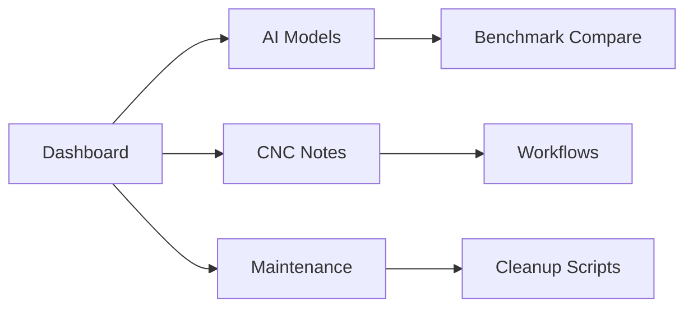

# 📊 **Vault Analytics Dashboard**

> Powered by Dataview - Live queries update in real-time!

---

## 🏗️ **Vault Health Overview**

### 📈 Note Statistics
```dataview
TABLE WITHOUT ID
  count(file.name) as "Total Notes",
  count(filter(file.tasks, (t) => t.completed)) as "Completed Tasks",
  min(file.mtime) as "Oldest Update",
  max(file.mtime) as "Latest Update"
FROM ""
GROUP BY true
```

### 🎯 Priority Tasks
```dataview
TABLE WITHOUT ID
  file.link as "Note",
  priority as "Priority",
  due as "Due Date"
FROM #priority
WHERE !completed
SORT priority DESC
```

### 🚨 Needs Review
```dataview
TABLE WITHOUT ID
  file.link as "Note",
  priority as "Priority",
  updated as "Last Updated"
FROM #needs-review
SORT updated ASC
```

---

## 🧠 **Knowledge Inventory**

### AI Models Library
```dataview
TABLE WITHOUT ID
  file.name as "Model",
  vram-required as "VRAM",
  context-window as "Context",
  status as "Status",
  benchmark-score as "⭐ Score"
FROM #ai-model
SORT benchmark-score DESC
```

### Current Production Models
```dataview
LIST FROM #ai-model
WHERE status = "production"
```

### CNC Resources
```dataview
TABLE WITHOUT ID
  file.name as "Resource",
  file.size as "Size (KB)",
  modified as "Modified"
FROM "CNC n Robotic"
WHERE !file.name starts with "."
SORT modified DESC
LIMIT 10
```

---

## ⏰ **Recent Activity**

### Last 5 Updates
```dataview
TABLE WITHOUT ID
  file.link as "Note",
  category as "Type",
  updated as "Updated"
FROM ""
WHERE file.mtime > date(today) - dur(7 days)
SORT updated DESC
LIMIT 5
```

### Streak Tracker
```dataview
TABLE WITHOUT ID
  file.link as "Daily Digest"
FROM #"vault-update"
WHERE file.name contains "daily"
SORT file.name DESC
LIMIT 7
```

---

## 🔗 **Related Notes Graph**

```
TABLE WITHOUT ID
  file.outlinks as "Links To"
FROM ""
WHERE file.link = [[vault-index]] 
LIMIT 10
```

---

## 🎛️ **Quick Actions**



---

*Auto-generated: {{date}}*  
*Refresh: Edit any note to update queries*